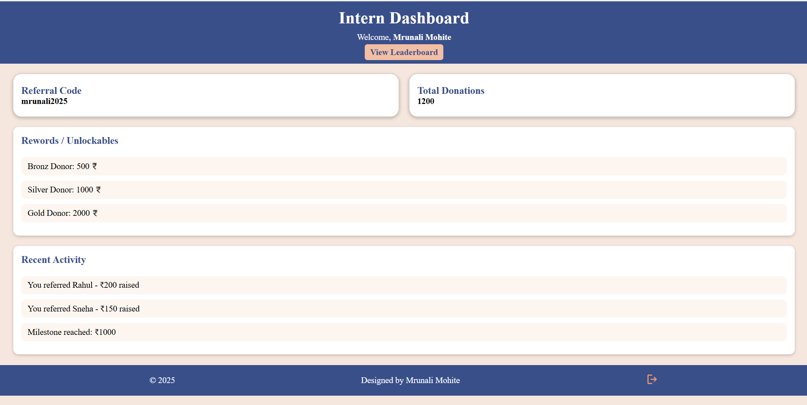

# intern-dashboard
A simple PHP-based Intern Dashboard that allows users to log in, view personal referral codes, track total donations, unlock rewards, view recent activity, and check the leaderboard.
The project uses a JSON file (data.json) for storing user details, activity logs, and leaderboard data, making it easy to set up without a database.
Built with PHP, HTML, CSS, and JavaScript, styled to be responsive and user-friendly.
# Features
- Login System: Updates user details in `data.json`
- Dashboard:Displays referral code, total donations, rewards, and recent activity
- Rewards System: Highlights unlocked rewards based on donation milestones
- Recent Activity Log: Shows user activity history
- Leaderboard: Displays top donors with rank, name, and donation amount
- Logout Functionality
- Responsive Design: Works on desktop and mobile

## Screenshots
**Login Page**

**Dashboard**

**Leaderboard**


## Setup Instructions

1. **Clone or Download the Repository**
   - Clone with Git:
     ```bash
     git clone https://github.com/your-name/intern-dashboard.git
     ```
   - Or click the green **Code** button on GitHub → **Download ZIP** → Extract it.

2. **Move the Project to Your PHP Server Directory**
   - For **XAMPP**: Move the folder to:
     ```
     C:/xampp/htdocs/intern-dashboard
     ```
   - For **WAMP**: Move the folder to:
     ```
     C:/wamp/www/intern-dashboard
     ```

3. **Start Apache** in your local server (XAMPP/WAMP).

4. **Open the Project in Your Browser**
http://localhost/intern-dashboard/index.php 
5. **Login**
- Enter any username and password (for demo purposes, password isn’t checked).
- The dashboard will load with your data.

6. **Explore the Features**
- **Dashboard** – View referral code, donations, rewards, and activity
- **Leaderboard** – See the top donors
- **Logout** – End the session

